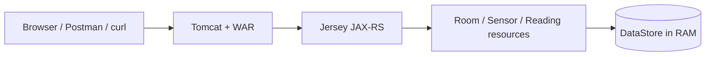
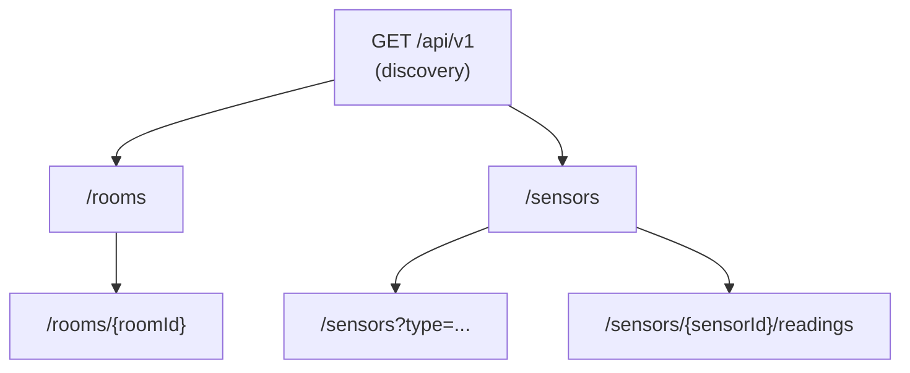
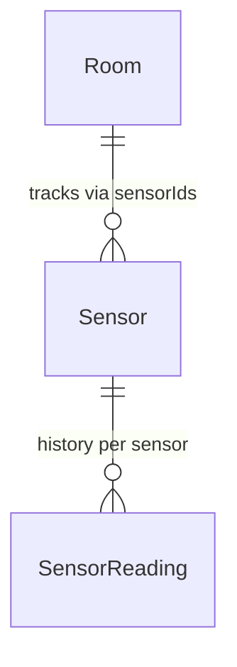

# Smart Campus - Sensor & Room API (5COSC022W)

Coursework submission for **Client-Server Architectures** (2025/26). I implemented a small REST API for the “Smart Campus” scenario: rooms, sensors, and a history of sensor readings. Everything is **JAX-RS (Jersey)** on top of Maven, deployed as a **WAR** to a servlet container (I used Tomcat locally). Data is kept **in memory** using `HashMap` / `ArrayList` only no database, as required.

Main packages: `com.smartcampus.resource` (REST classes), `com.smartcampus.model` (POJOs), `com.smartcampus.store` (`DataStore`), `com.smartcampus.exception` (custom errors + mappers), `com.smartcampus.filter` (logging).


---

## How to build and run

**You need:** JDK 8+, Maven 3.x, and something like **Apache Tomcat**.

1. From the project folder:

   ```bash
   mvn clean package
   ```

2. Take `target/smart-campus-api-1.0-SNAPSHOT.war`, copy it to Tomcat’s `webapps` folder (you can rename it e.g. `smart-campus.war`).

3. Start Tomcat. If the app is at context `/smart-campus`, the API base is:

   ```text
   http://localhost:8080/smart-campus/api/v1
   ```

   I’ll call that **`BASE_URL`** below.

The app is registered with **`@ApplicationPath("/api/v1")`** on `SmartCampusApplication` (Jersey `ResourceConfig`, which still counts as the JAX-RS `Application` entry point).


---

## Design overview

I tried to mirror how the campus is actually organised: **rooms** exist first, **sensors** belong to a room, and each sensor has its own **readings** over time. The API entry point is `GET /api/v1`, which returns a bit of metadata plus links so a client knows where `rooms` and `sensors` live (sort of a “start here” page).

Technically it’s a normal Maven WAR: Tomcat (or similar) receives the HTTP call, Jersey matches the path to a resource class, and the classes read/write **`DataStore`** - which is just maps and lists in memory. Custom exceptions go through **`ExceptionMapper`** classes so the client always gets JSON errors instead of ugly stack traces. There is also a small **`ApiLoggingFilter`** so I can see method, URI, and status in the server log when testing.

**Rough breakdown of what the code does**

- **Discovery** - one GET at the root of `/api/v1` for version/contact/links.  
- **Rooms** - list/create, fetch by id, delete (delete is blocked if the room still has sensors attached). New room POST returns **201** and a **Location** header.  
- **Sensors** - list with optional `?type=...`, register with JSON (room must exist or you get **422**; wrong `Content-Type` gives **415**).  
- **Readings** - nested under `/sensors/{id}/readings` via a sub-resource class; posting a reading updates the parent sensor’s `currentValue`.  
- **Errors / logging** - mappers for **409 / 422 / 403**, a catch-all **500** mapper, plus the filter mentioned above.

The longer explanations (lifecycle, HATEOAS, idempotency, etc.) are in the **Written report** section further down that’s where I answered the coursework questions properly.

### Diagram 1 - request path (high level)



### Diagram 2 - main resources and nesting



### Diagram 3 - how the domain objects relate



*(If Mermaid does not render in your viewer, open the README on GitHub - it supports these diagrams natively.)*


---

## API summary

| Method | Path | Notes |
|--------|------|--------|
| GET | `/api/v1` | Discovery: metadata + links |
| GET, POST | `/api/v1/rooms` | List / create room |
| GET, DELETE | `/api/v1/rooms/{roomId}` | Detail / delete (delete blocked if sensors still linked) |
| GET, POST | `/api/v1/sensors` | List (optional `?type=`), register sensor |
| GET, POST | `/api/v1/sensors/{sensorId}/readings` | History / append reading |

**Models:** `Room`, `Sensor`, `SensorReading` (+ `ErrorMessage` for errors).


---

## Example `curl` commands

Set your base URL first:

```bash
BASE_URL="http://localhost:8080/smart-campus/api/v1"
```

1. **Discovery (`GET /api/v1`)**

   ```bash
   curl -i "$BASE_URL"
   ```

2. **Create a room - check `201` and `Location` header**

   ```bash
   curl -i -X POST \
     -H "Content-Type: application/json" \
     -d '{"id":"LIB-301","name":"Library Quiet Study","capacity":40}' \
     "$BASE_URL/rooms"
   ```

3. **List rooms and get one by id**

   ```bash
   curl -i "$BASE_URL/rooms"
   curl -i "$BASE_URL/rooms/LIB-301"
   ```

4. **Register a sensor (valid room)**

   ```bash
   curl -i -X POST \
     -H "Content-Type: application/json" \
     -d '{"id":"TEMP-001","type":"Temperature","status":"ACTIVE","currentValue":21.5,"roomId":"LIB-301"}' \
     "$BASE_URL/sensors"
   ```

5. **Filter sensors by type (`@QueryParam`)**

   ```bash
   curl -i "$BASE_URL/sensors?type=CO2"
   ```

6. **Wrong content-type on POST - expect `415 Unsupported Media Type`**

   ```bash
   curl -i -X POST \
     -H "Content-Type: text/plain" \
     -d 'not json' \
     "$BASE_URL/sensors"
   ```

7. **Add a reading (updates `currentValue` on the sensor)**

   ```bash
   curl -i -X POST \
     -H "Content-Type: application/json" \
     -d '{"timestamp":1713868800000,"value":22.3}' \
     "$BASE_URL/sensors/TEMP-001/readings"
   ```

8. **Delete room that still has sensors - expect `409` + JSON error**

   ```bash
   curl -i -X DELETE "$BASE_URL/rooms/LIB-301"
   ```

9. **POST sensor with bad `roomId` - expect `422` + JSON**

   ```bash
   curl -i -X POST \
     -H "Content-Type: application/json" \
     -d '{"id":"X-1","type":"CO2","status":"ACTIVE","currentValue":0,"roomId":"NO-SUCH-ROOM"}' \
     "$BASE_URL/sensors"
   ```


---

## Written report (answers to the brief)

### Part 1.1 - JAX-RS setup, lifecycle, and in-memory data

**Setup:** I used Maven to pull in **Jersey** (`jersey-container-servlet`, Jackson for JSON, HK2). The application class is `SmartCampusApplication` with `@ApplicationPath("/api/v1")` so everything hangs under that versioned root.

**Lifecycle (request-scoped vs singleton):** By default, JAX-RS resources like `RoomResource` and `SensorResource` are **created per request** (not a single long-lived singleton instance). That means you should not rely on instance fields to hold shared data - it would either be wrong logically or get lost between requests. Because of that, I keep all shared data in a static `DataStore` (`HashMap`s etc.) that every request hits.

**Synchronisation / race conditions:** I know this is only coursework, but it’s worth saying honestly: the room and sensor maps are normal `HashMap`s, which are **not** thread-safe if two threads write at the same time. The reading lists use `Collections.synchronizedList` which helps a bit for the list operations, but the maps could still race under heavy concurrency. In a real deployment you’d use concurrent collections or a database with proper transactions. I still kept everything in memory as required.


### Part 1.2 - Discovery endpoint and HATEOAS

`GET /api/v1` returns JSON with **`version`**, **`contact`**, and a **`links`** object pointing at `/api/v1/rooms` and `/api/v1/sensors`.

**Why hypermedia / HATEOAS matters:** Instead of hard-coding URLs in every client, the API tells you where the main collections live. If paths change later, clients that start from the discovery document and follow links are less likely to break than clients that only read a static PDF. It’s not full hypermedia everywhere, but the root still works as a sensible **entry point** for the API.


### Part 2.1 - Room CRUD, `201 Created`, `Location`, list payload shape

I implemented `GET` and `POST` on `/rooms`, plus `GET /rooms/{roomId}` for a single room. Successful **`POST` returns HTTP 201**, the **JSON body** of the room, and a **`Location` header** pointing at the new resource URI (e.g. `.../rooms/LIB-301`), built with `UriInfo` so it matches how the app is deployed.

**IDs only vs full objects for `GET /rooms`:** Returning **only ids** keeps the response small on the wire (good if you had loads of rooms or huge metadata). Returning **full objects** (what I did) means more bytes per response, but the client can show names and capacity **without** doing N extra `GET /rooms/{id}` calls. For this scale I preferred full objects for simplicity.


### Part 2.2 - DELETE integrity and idempotency

**Integrity:** You cannot delete a room if its `sensorIds` list is not empty - that would orphan sensors from the room’s point of view. In that case I throw `RoomNotEmptyException`, mapped to **409 Conflict** with a JSON message.

**Idempotency:** The first successful delete on an empty room returns **204** and removes it. If you send the **same DELETE again**, the room is already gone so you get **404**. The **server state** (room absent) is the same after both calls, so I argue the operation is still **idempotent in terms of state**, even though the status code differs. Repeating DELETE does not bring the room back or keep flipping state.


### Part 3.1 - Sensor validation and `415` on wrong media type

Before saving a sensor, I look up `roomId` in `DataStore`. If it’s missing I throw `LinkedResourceNotFoundException` → **422** (see Part 5.1).

The resource class uses **`@Consumes(APPLICATION_JSON)`**. If the client sends e.g. **`text/plain`** or **`application/xml`**, Jersey can’t find a body reader that turns that into my `Sensor` POJO, so the request fails with **415 Unsupported Media Type** before my method runs. That’s the practical effect of `@Consumes`.


### Part 3.2 - `GET /sensors?type=` and query vs path

Filtering uses **`@QueryParam("type")`**. An alternative would be something like `/sensors/type/CO2` with a path segment.

**Why I prefer query parameters for filters:** The collection is still **`/sensors`**; the filter is an optional refinement. You can combine filters later (`?type=CO2&status=ACTIVE`) without inventing new path templates every time. It also matches how a lot of HTTP caches and tools treat “same resource, different query” for searches.


### Part 4.1 - Sub-resource locator pattern

On `SensorResource` I have a method annotated with `@Path("/{sensorId}/readings")` that **returns a new `SensorReadingResource(sensorId)`**. That’s the **sub-resource locator** pattern.

**Why it helps in bigger APIs:** Sensor CRUD and “readings under this sensor” are different concerns. Splitting them stops one giant class from owning every nested path (`.../readings`, future `.../alerts`, etc.). It’s easier to read, test, and extend.


### Part 4.2 - Readings history and updating `currentValue`

`GET .../readings` returns the list from `DataStore`. `POST` adds a `SensorReading` (server assigns a UUID if `id` is null). After a successful POST I set the parent **`Sensor.currentValue`** to the new reading’s **value** so the “live” field matches the latest measurement.

If the sensor is in **`MAINTENANCE`**, POST throws `SensorUnavailableException` → **403** (sensor shouldn’t accept readings). Unknown sensor id returns **404**.


### Part 5.1 - Specific exception mappers (`409`, `422`, `403`) and JSON

| Exception | HTTP | Meaning |
|-----------|------|---------|
| `RoomNotEmptyException` | 409 | Room still has sensors; delete blocked |
| `LinkedResourceNotFoundException` | 422 | e.g. `roomId` in JSON doesn’t exist |
| `SensorUnavailableException` | 403 | e.g. sensor in `MAINTENANCE` |

Each mapper returns JSON using my **`ErrorMessage`** type (`message` + `status` code), not HTML or plain text stack traces.

**Why 422 instead of 404 for a bad `roomId` in the body:** The client posted to **`/sensors`**, which **exists**. The JSON is syntactically fine. The problem is **semantic**: the referenced room id is wrong. **404** usually means “this URL resource isn’t here”, which would confuse people into thinking `/sensors` was wrong. **422** signals “your entity is understood but **can’t be processed** because of invalid references / business rules”.


### Part 5.2 - Global `Throwable` mapper and security

`GenericExceptionMapper` implements **`ExceptionMapper<Throwable>`** and turns anything unexpected into **500 Internal Server Error** with a **generic JSON message**. It does **not** echo stack traces or internal class names to the client.

**Why exposing stack traces is bad:** Attackers can learn your **package names**, **frameworks**, **file paths**, and sometimes **hints about versions** or config. That makes targeted exploits and reconnaissance easier. Keeping errors generic is basic **security hygiene** for a public API.


### Extra (module brief) - logging filter vs logging in every method

I added `ApiLoggingFilter` as both **`ContainerRequestFilter`** and **`ContainerResponseFilter`**, using `java.util.logging.Logger`. It logs **method + full URI** on the request side and the **response status** on the way out.

**Why a filter:** If I scattered `LOG.info` in every resource method, changing the format or adding a correlation id would mean editing lots of files. The filter keeps logging **centralised** and consistent for all endpoints.


---

## Video demonstration

I recorded a separate video walkthrough (Postman / curl) covering discovery, rooms, sensors (including **422** and **415**), readings, **403** for maintenance, **409** on delete, and the **500** safety net, and uploaded it via the **Blackboard** submission as required.


---

## References / notes

- Course module: **5COSC022W** - University of Westminster  
- JAX-RS implementation: **Jersey 2.x**  
- I did **not** use Spring Boot or any SQL database, to stay within the brief.
