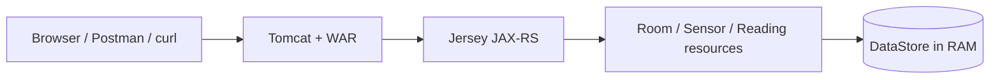
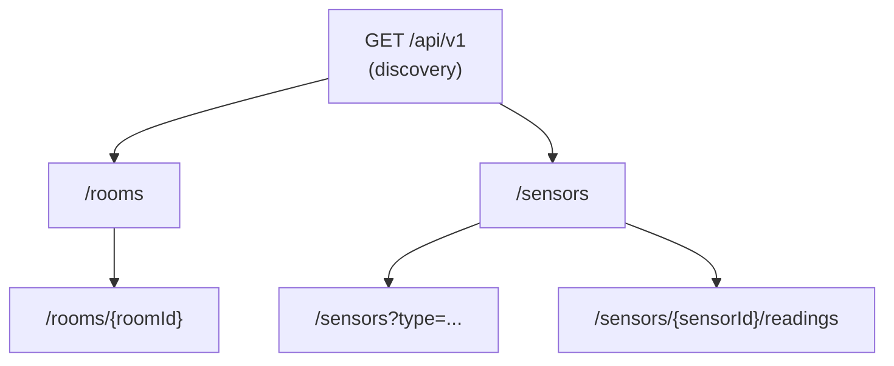
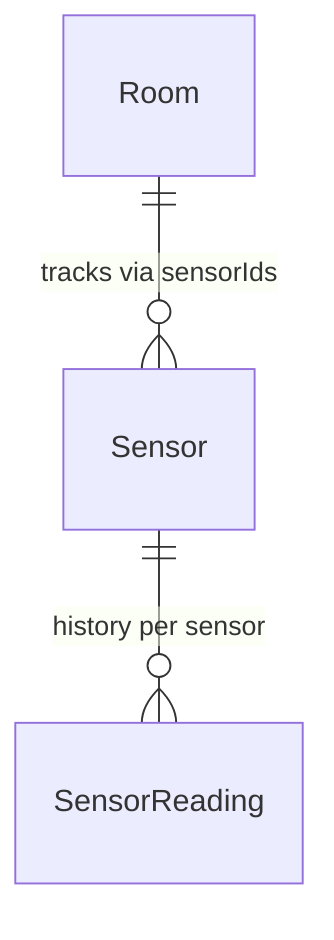

# Smart Campus — Sensor & Room Management API

**Module:** 5COSC022W Client-Server Architectures (2025/26)  
**Student:** Thevindu Wickramaarachchi — w2151910  
**GitHub:** [Repository Link](https://github.com/thev1ndu/w2151910_csa_cw)

A RESTful API for the university "Smart Campus" initiative, built with **JAX-RS (Jersey)** and deployed as a **WAR** on Apache Tomcat. The service manages **rooms**, **sensors** deployed within them, and a **historical log of sensor readings**. All data is stored **in memory** using `ConcurrentHashMap` and `CopyOnWriteArrayList` — no database technology is used.

---

## How to build and run

**Prerequisites:** JDK 8+, Maven 3.x, Apache Tomcat (or any servlet container).

1. Build the WAR:

   ```bash
   mvn clean package
   ```

2. Copy `target/smart-campus-api-1.0-SNAPSHOT.war` into Tomcat's `webapps/` folder.

3. Start Tomcat. The API is available at:

   ```
   http://localhost:8080/api/v1
   ```

The entry point is registered via `@ApplicationPath("/api/v1")` on the `SmartCampusApplication` class, which extends `javax.ws.rs.core.Application`.

---

## API design overview

The API mirrors the physical campus structure: **rooms** are the top-level resource, **sensors** are deployed inside rooms, and each sensor accumulates **readings** over time. A discovery endpoint at the API root provides metadata and navigational links so clients always know where to start.



### Resource hierarchy



### Domain model relationships



### Endpoint summary

| Method      | Path                                  | Description                                              |
| ----------- | ------------------------------------- | -------------------------------------------------------- |
| GET         | `/api/v1`                             | Discovery — metadata, version, HATEOAS links             |
| GET, POST   | `/api/v1/rooms`                       | List all rooms / create a new room                       |
| GET, DELETE | `/api/v1/rooms/{roomId}`              | Get room detail / delete (blocked if sensors are linked) |
| GET, POST   | `/api/v1/sensors`                     | List sensors (optional `?type=` filter) / register       |
| GET, POST   | `/api/v1/sensors/{sensorId}/readings` | Reading history / append a new reading                   |

**Models:** `Room`, `Sensor`, `SensorReading`, `ErrorMessage`.

---

## Sample `curl` commands

```bash
# Discovery
curl -i "http://localhost:8080/api/v1"

# List all rooms
curl -i "http://localhost:8080/api/v1/rooms"

# Create a room
curl -i -X POST -H "Content-Type: application/json" \
  -d '{"id":"LIB-301","name":"Library Quiet Study","capacity":40}' \
  "http://localhost:8080/api/v1/rooms"

# Get a single room
curl -i "http://localhost:8080/api/v1/rooms/LIB-301"

# Delete a room
curl -i -X DELETE "http://localhost:8080/api/v1/rooms/LIB-301"

# List sensors (with optional type filter)
curl -i "http://localhost:8080/api/v1/sensors"
curl -i "http://localhost:8080/api/v1/sensors?type=Temperature"

# Register a sensor
curl -i -X POST -H "Content-Type: application/json" \
  -d '{"id":"TEMP-001","type":"Temperature","status":"ACTIVE","currentValue":21.5,"roomId":"LIB-301"}' \
  "http://localhost:8080/api/v1/sensors"

# Post a reading
curl -i -X POST -H "Content-Type: application/json" \
  -d '{"timestamp":1713868800000,"value":22.3}' \
  "http://localhost:8080/api/v1/sensors/TEMP-001/readings"

# Get readings history
curl -i "http://localhost:8080/api/v1/sensors/TEMP-001/readings"
```

---

## Written report (answers to the brief)

### Part 1: Service Architecture & Setup

#### 1.1 — Project configuration and JAX-RS resource lifecycle

The project is built as a Maven WAR using **Jersey** as the JAX-RS implementation. The key dependencies are `jersey-container-servlet` (to run on Tomcat), `jersey-media-json-jackson` (to convert Java objects to/from JSON), and HK2 for dependency injection. The main entry point is the `SmartCampusApplication` class, which has `@ApplicationPath("/api/v1")` — this tells Jersey that all our endpoints start from `/api/v1`. Jersey automatically picks up any class annotated with `@Path` (our resource classes) and `@Provider` (our filters and exception mappers).

**Resource lifecycle:** By default, JAX-RS creates a **new instance** of each resource class (like `RoomResource`, `SensorResource`) for every single HTTP request. Once the response is sent, that instance is thrown away. This means if I stored data in a field like `private List<Room> rooms` inside `RoomResource`, that data would be lost after every request because the next request gets a brand new object.

**How I handle shared data:** Since resource instances are temporary, I needed a way to keep data alive across requests. I solved this with a **singleton `DataStore` class** — it has a private constructor and a static `getInstance()` method so there is only ever one copy. Every resource class calls `DataStore.getInstance()` to access the same shared data.

To handle **thread safety** (since Tomcat uses multiple threads to serve requests at the same time), `DataStore` uses **`ConcurrentHashMap`** instead of a regular `HashMap` for storing rooms, sensors, and reading lists. `ConcurrentHashMap` allows multiple threads to read from the map at the same time without blocking each other, and handles write operations safely using internal locking on smaller segments rather than locking the entire map. For the lists of sensor readings, I use **`CopyOnWriteArrayList`** instead of `ArrayList` — this is ideal because readings are read frequently (when querying history) but written to less often (only when a new reading is posted), so the small overhead on writes is worth the benefit of safe, lock-free reads. I also use `computeIfAbsent` to safely create new reading lists — this avoids a common bug where two threads could both check if a list exists and both try to create one at the same time. Using these `java.util.concurrent` classes means I don't need any `synchronized` blocks, which gives better performance.

#### 1.2 — Discovery endpoint and HATEOAS

`GET /api/v1` returns a JSON object with the API **name**, **version**, **description**, **contact info**, and a **links** section. The links are built at runtime using `@Context UriInfo` — this means the URLs always match whatever server the WAR is deployed on, so the API works without changing any code whether it's on `localhost:8080` or a production server.

**Why HATEOAS matters:** HATEOAS (Hypermedia as the Engine of Application State) means the API includes links in its responses that tell the client what it can do next. Instead of the client having to know all the URLs in advance, it can just follow the links. This is useful because if the server changes its URL structure (say from `/api/v1/rooms` to `/api/v2/spaces`), clients that follow links will still work, but clients with hardcoded URLs would break. It also makes the API self-documenting — a developer can discover everything just by starting from the root endpoint and following links, without reading separate documentation.

---

### Part 2: Room Management

#### 2.1 — Room resource implementation

`RoomResource` handles the `/rooms` path and supports:

- **`GET /rooms`** — returns all rooms as a JSON array.
- **`POST /rooms`** — creates a new room. Returns `201 Created` with the room in the body and a `Location` header pointing to the new room's URL (built using `UriInfo.getAbsolutePathBuilder()`), so the client can immediately access it.
- **`GET /rooms/{roomId}`** — returns a specific room by ID, or `404 Not Found` with an error message if the room doesn't exist.

**Why I return full objects instead of just IDs:** When listing rooms, I return the complete room data (id, name, capacity, sensorIds) rather than just a list of IDs. If I only returned IDs, the client would have to make a separate `GET` request for every single room to get its details — this is called the "N+1 problem" and leads to many unnecessary requests. Returning full objects means the client gets everything it needs in a single call, which is faster and simpler. The trade-off is a slightly bigger response, but for a campus-scale system this is a much better approach.

#### 2.2 — Room deletion and idempotency

**Preventing broken references:** Before deleting a room, `DELETE /rooms/{roomId}` checks if any sensors are still assigned to it. If the room's `sensorIds` list is not empty, the delete is blocked and the API throws a `RoomNotEmptyException`, which returns `409 Conflict` with a message telling the client to remove sensors first. This prevents sensors from pointing to a room that no longer exists.

**Idempotency:** The first DELETE removes the room and returns `204 No Content`. If the client sends the same DELETE again, the room is already gone, so it returns `404 Not Found`. Even though the status code changes (204 → 404), the **server state is the same** after both calls — the room doesn't exist. This is what makes DELETE idempotent: repeated identical requests leave the server in the same state. It doesn't undo the deletion or cause any extra side effects. This matches what the HTTP spec says — "the side-effects of N > 0 identical requests is the same as for a single request" (RFC 7231).

---

### Part 3: Sensor Operations & Linking

#### 3.1 — Sensor registration and `@Consumes` enforcement

`SensorResource` at `/sensors` supports:

- **`POST /sensors`** — registers a new sensor. Before saving, it checks that the `roomId` in the request body actually exists in `DataStore`. If the room doesn't exist, it throws `LinkedResourceNotFoundException`, which maps to `422 Unprocessable Entity` (explained in Part 5).
- On success, the sensor is saved, the room's `sensorIds` list is updated, and the response is `201 Created` with a `Location` header.

**What `@Consumes(MediaType.APPLICATION_JSON)` does:** This annotation tells JAX-RS that this method only accepts JSON. If a client sends a request with a different content type (like `text/plain` or `application/xml`), JAX-RS automatically rejects it with `415 Unsupported Media Type` — my code doesn't even run. This acts as a guard that makes sure only properly formatted JSON reaches my business logic.

#### 3.2 — Filtered retrieval with `@QueryParam`

`GET /sensors` has an optional `@QueryParam("type")` parameter. If provided (e.g. `GET /sensors?type=Temperature`), only sensors of that type are returned. If not provided, all sensors are returned.

**Why query parameters instead of path-based filtering:** Instead of doing something like `/sensors/type/CO2`, I used query parameters (`?type=CO2`) because:

1. **The resource stays the same.** `/sensors` is always the sensor collection — the query parameter just filters the view, it doesn't change what resource you're accessing.
2. **Easy to combine.** You can add multiple filters like `?type=CO2&status=ACTIVE` without needing new `@Path` templates for every combination.
3. **Works with caching.** HTTP caches treat query strings as different views of the same resource, which is exactly what filtering is.
4. **It's the standard approach.** Major APIs like GitHub, Stripe, and AWS all use query parameters for filtering.

---

### Part 4: Deep Nesting with Sub-Resources

#### 4.1 — Sub-resource locator pattern

In `SensorResource`, the method at `@Path("/{sensorId}/readings")` doesn't have `@GET` or `@POST` on it. Instead, it acts as a **sub-resource locator** — it creates a new `SensorReadingResource` object, passes it the `sensorId`, and returns it. Jersey then calls the right method (GET or POST) on that returned object.

**Why this design is better than putting everything in one class:**

1. **Separation of concerns.** Sensor CRUD and reading history are different responsibilities, so they belong in different classes.
2. **Easier to extend.** If I later need to add `.../alerts` or `.../calibration-logs` under a sensor, each gets its own class instead of cramming more methods into `SensorResource`.
3. **Easier to test.** I can test `SensorReadingResource` on its own by just creating it with a sensor ID, without going through the parent resource.
4. **Reusable.** The same sub-resource class could potentially be used under different parent resources if the API grows.

#### 4.2 — Historical data management and `currentValue` updates

`SensorReadingResource` has two operations:

- **`GET`** — returns all readings for the sensor, or `404` if the sensor doesn't exist.
- **`POST`** — adds a new reading. The server auto-generates a UUID for the reading if the client doesn't provide one, and sets the timestamp to the current time if it's missing.

**Updating `currentValue`:** After adding a new reading, the method also updates the sensor's `currentValue` to match the new reading's value. This keeps the data consistent — when you later do `GET /sensors/TEMP-001`, the `currentValue` will always show the latest measurement.

**Maintenance mode:** If a sensor's status is `"MAINTENANCE"`, it can't accept new readings. Trying to POST a reading to it throws `SensorUnavailableException`, which returns `403 Forbidden`.

---

### Part 5: Error Handling, Exception Mapping & Logging

Every error response uses a consistent `ErrorMessage` object with three fields: `error` (a short label), `status` (the HTTP code), and `message` (a readable explanation). This means the API never leaks raw Java stack traces or default Tomcat error pages.

#### 5.1 — Resource Conflict (409)

**When it happens:** Trying to delete a room that still has sensors linked to it.  
**How it works:** `RoomResource.deleteRoom()` checks if the room has any sensors. If it does, it throws `RoomNotEmptyException`, which `RoomNotEmptyExceptionMapper` catches and returns as `409 Conflict` with a message explaining the sensors need to be removed first.

#### 5.2 — Dependency Validation (422)

**When it happens:** Creating a sensor with a `roomId` that doesn't exist.  
**How it works:** `SensorResource.createSensor()` looks up the `roomId` in `DataStore`. If it doesn't exist, it throws `LinkedResourceNotFoundException`, and the mapper returns `422 Unprocessable Entity`.

**Why 422 and not 404:** The request was sent to `/sensors`, which is a valid endpoint. The JSON was correctly formatted. The only problem is that the `roomId` inside the JSON doesn't refer to a real room — this is a **semantic** error, not a "page not found" error. Using `404` would confuse the client into thinking the `/sensors` endpoint doesn't exist. `422` says "I understood your request, but the data inside it doesn't make sense" — which is exactly the right message.

#### 5.3 — State Constraint (403)

**When it happens:** Posting a reading to a sensor that's in `"MAINTENANCE"` mode.  
**How it works:** `SensorReadingResource.addReading()` checks the sensor's status. If it's `"MAINTENANCE"`, it throws `SensorUnavailableException`, which returns `403 Forbidden`.

| Exception                         | HTTP | When it happens                        |
| --------------------------------- | ---- | -------------------------------------- |
| `RoomNotEmptyException`           | 409  | Room still has sensors; delete blocked |
| `LinkedResourceNotFoundException` | 422  | `roomId` in JSON body doesn't exist    |
| `SensorUnavailableException`      | 403  | Sensor in `MAINTENANCE` mode           |

#### 5.4 — Global Safety Net (500)

`GenericExceptionMapper` implements `ExceptionMapper<Throwable>` and catches any unexpected exception (like a `NullPointerException`). It logs the full error details internally using `Logger.log(Level.SEVERE, ...)` so I can debug it, but only sends a generic `"An unexpected error occurred."` message to the client with status `500`.

**Why not show stack traces to clients:** If the API returned full Java stack traces, an attacker could learn:

- **Class and package names** — revealing the internal code structure.
- **Framework versions** — letting them search for known security vulnerabilities (CVEs) in those versions.
- **File paths** — exposing server directory structure and OS details.
- **Method names and line numbers** — giving them a map of the code to find weaknesses.

This is called **information disclosure** and is listed in the OWASP Top 10 (A01:2021). Keeping error responses generic is basic security practice.

#### 5.5 — API Request & Response Logging Filter

`LoggingFilter` implements `ContainerRequestFilter` and `ContainerResponseFilter`, registered with `@Provider`. For every request, it logs the HTTP method, URI, Content-Type, and Accept headers. For every response, it logs the method, URI, status code, and how long the request took to process (by recording the start time on the way in and calculating the difference on the way out).

**Why use a filter instead of adding logging to every method:** Logging is something that needs to happen on every endpoint, so it shouldn't be mixed into business logic. Using a filter means:

1. **No code duplication.** I write the logging code once, not in every method.
2. **Consistency.** Every endpoint gets logged in the same format automatically.
3. **Easy to change.** If I need to update the log format, I change one class instead of editing every resource method.
4. **Clean code.** Resource methods focus purely on their job (handling rooms, sensors, etc.) without logging clutter.

---

## Video demonstration

The full video walkthrough was recorded separately and submitted via **Blackboard**. The video covers all 12 steps described in the demo scenario above, demonstrating every endpoint, error case (422, 409, 415, 403), the sub-resource locator pattern, and DELETE idempotency.

---

## References

- Course module: **5COSC022W** — University of Westminster
- JAX-RS implementation: **Jersey 2.x** (javax namespace)
- No Spring Boot or database technology was used, as required by the coursework brief
