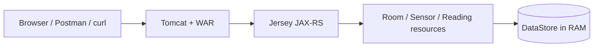
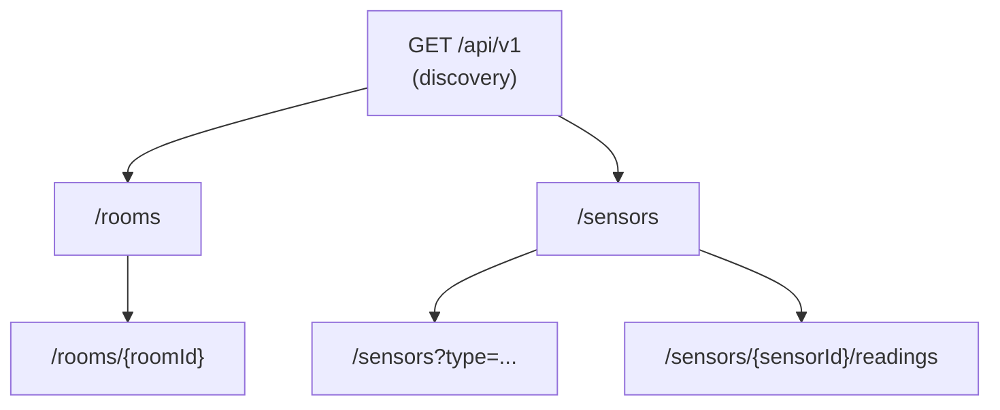
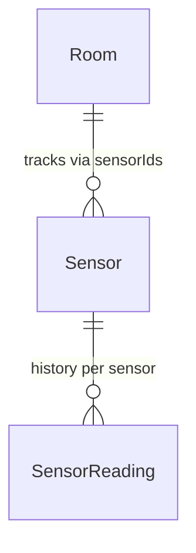

# Smart Campus — Sensor & Room Management API

**Module:** 5COSC022W Client-Server Architectures (2025/26)  
**Student:** Thevindu Wickramaarachchi — w2151910  
**GitHub:** [Repository Link](https://github.com/thev1ndu/w2151910_csa_cw)

A RESTful API for the university "Smart Campus" initiative, built with **JAX-RS (Jersey)** and deployed as a **WAR** on Apache Tomcat. The service manages **rooms**, **sensors** deployed within them, and a **historical log of sensor readings**. All data is stored **in memory** no database technology is used.

---

## API design overview

The API mirrors the physical campus structure: **rooms** are the top-level resource, **sensors** are deployed inside rooms, and each sensor accumulates **readings** over time. A discovery endpoint at the API root provides metadata and navigational links so clients always know where to start.



### Resource hierarchy



### Domain model relationships



### Endpoint summary

| Method      | Path                                  | Description                                              |
| ----------- | ------------------------------------- | -------------------------------------------------------- |
| GET         | `/api/v1`                             | Discovery — metadata, version, HATEOAS links             |
| GET, POST   | `/api/v1/rooms`                       | List all rooms / create a new room                       |
| GET, DELETE | `/api/v1/rooms/{roomId}`              | Get room detail / delete (blocked if sensors are linked) |
| GET, POST   | `/api/v1/sensors`                     | List sensors (optional `?type=` filter) / register       |
| GET, POST   | `/api/v1/sensors/{sensorId}/readings` | Reading history / append a new reading                   |

**Models:** `Room`, `Sensor`, `SensorReading`, `ErrorMessage`.

---

## Sample `curl` commands

```bash
# Discovery
curl -i "http://localhost:8080/api/v1"

# List all rooms
curl -i "http://localhost:8080/api/v1/rooms"

# Create a room
curl -i -X POST -H "Content-Type: application/json" \
  -d '{"id":"LIB-301","name":"Library Quiet Study","capacity":40}' \
  "http://localhost:8080/api/v1/rooms"

# Get a single room
curl -i "http://localhost:8080/api/v1/rooms/LIB-301"

# Delete a room
curl -i -X DELETE "http://localhost:8080/api/v1/rooms/LIB-301"

# List sensors (with optional type filter)
curl -i "http://localhost:8080/api/v1/sensors"
curl -i "http://localhost:8080/api/v1/sensors?type=Temperature"

# Register a sensor
curl -i -X POST -H "Content-Type: application/json" \
  -d '{"id":"TEMP-001","type":"Temperature","status":"ACTIVE","currentValue":21.5,"roomId":"LIB-301"}' \
  "http://localhost:8080/api/v1/sensors"

# Post a reading
curl -i -X POST -H "Content-Type: application/json" \
  -d '{"timestamp":1713868800000,"value":22.3}' \
  "http://localhost:8080/api/v1/sensors/TEMP-001/readings"

# Get readings history
curl -i "http://localhost:8080/api/v1/sensors/TEMP-001/readings"
```

---

## Written Report (Answers to the Brief)

### Part 1: Service Architecture & Setup

**Q: Explain the default lifecycle of a JAX-RS Resource class. Is a new instance instantiated for every incoming request, or does the runtime treat it as a
singleton? Elaborate on how this architectural decision impacts the way you manage and synchronize your in-memory data structures (maps/lists) to prevent data loss or race conditions.**

By default, JAX-RS follow a per request lifecycle which means the runtime creates a fresh instance of each resource class such as RoomResource or SensorResource for every incoming HTTP request, and discards it once the response is sent. This design prevents one request from accidentally corrupting state for another but it also means that any data stored in instance fields is lost between requests.

To persist data across requests application uses a singleton DataStore class with a private constructor and a static getInstance() method, ensuring that only one shared instance exists. All resource classes obtain a reference to this same object. Because Apache Tomcat serves requests concurrently across multiple threads, the DataStore must be thread safe the implementation uses standard HashMap and ArrayList combined with method-level synchronized control to ensure safe access to shared state.

The synchronized keyword ensures that only one thread can access a method or block at a time using a built-in locking mechanism in Java. This guarantees atomicity for multi step operations such as adding a sensor and updating its associated room, prevents race conditions, and it ensure that changes made by one thread are visible to others. This approach ensures strong consistency and predictable behavior by preventing concurrent modification of shared data structures and eliminating race conditions.

**Q: Why is the provision of ”Hypermedia” (links and navigation within responses) considered a hallmark of advanced RESTful design (HATEOAS)? How does this approach benefit client developers compared to static documentation?**

HATEOAS (Hypermedia as the Engine of Application State) is a REST principle where API responses include links that show clients what they can do next. Instead of using hardcoded URLs, clients can discover available actions at runtime based on the current state of the resource. For example, the DiscoveryResource at GET /api/v1 builds links to /rooms and /sensors using @Context UriInfo, so the URLs automatically match the server’s host and port.

This approach helps client developers by reducing tight coupling to both URLs and how the API works. Clients do not need to hardcode API calls, because they can simply follow the links returned by the server. This means backend changes, such as renaming or versioning endpoints, are less likely to break clients. It also makes the API easier to understand, as developers can start from a root endpoint and explore available resources through links instead of relying only on external documentation.

---

### Part 2: Room Management

**Q: When returning a list of rooms, what are the implications of returning only IDs versus returning the full room objects? Consider network bandwidth and client side processing.**

The GET /rooms endpoint returns complete Room objects including id, name, capacity, and sensorIds rather than only specific identifiers. If only IDs were returned the client need to make an additional GET /rooms/{roomId} request for each room to retrieve details. This results in the N+1 problem wheres a single logical operation may trigger multiple network requests.

In a system with potentially hundreds of rooms this would lead to excessive network round trips which may increased latency, and additional load on the server due to repeated requests handling. Since each request incurs network overhead and processing cost the cumulative impact may lead to significant performance degrade.

By returning full room objects in a single response, the API enables the client to obtain all required data in single request it improves efficiency and reduces overall latency. This approach minimizes network overhead and simplifies client-side processing, As the client does not need to orchestrate multiple dependent calls. The slightly larger payload size remains acceptable for structured data of this scale and is outweighed by the performance benefits of reducing multiple request response cycles.

**Q: Is the DELETE operation idempotent in your implementation? Provide a detailed justification by describing what happens if a client mistakenly sends the exact same DELETE request for a room multiple times.**

Yes, the DELETE /rooms/{roomId} operation is idempotent. On the first successful request the specified room is removed from the DataStore and the server returns 204 No Content. If the same request is sent again, the room no longer exists, so the server will returns 404 Not Found.

This difference in response status does not violate idempotency, because idempotency is defined in terms of server side state nor not response codes. In both cases, the final state of the system remains the same the room is absent. Repeating the same DELETE requests does not introduce any additional side effect, which will satisfies the idempotency requirement that multiple identical requests results in the same state as a single request.

Additionally, if the room still has any associated sensors the operation returns 409 Conflict as a response and it prevents deletion. This behavior is also idempotent, as repeated requests under the same conditions will consistently produce the same outcome without altering the system state.

---

### Part 3: Sensor Operations & Linking

**Q: We explicitly use the @Consumes (MediaType.APPLICATION_JSON) annotation on the POST method. Explain the technical consequences if a client attempts to send data in a different format, such as text/plain or application/xml. How does JAX-RS handle this mismatch?**

The @Consumes(MediaType.APPLICATION_JSON) annotation on the POST /sensors method instructs the JAX-RS runtime to only accept request bodies with a Content-Type of application/json. When a request is received, the runtime attempts to match the incoming Content-Type header with a suitable mechanism to deserialize the payload into the target Java object.

If a client sends data in a different format, such as text/plain or application/xml, no compatible handler is found for the declared media type. As a result, the JAX-RS runtime rejects the request at the framework level and returns an HTTP 415 Unsupported Media Type response before invoking the resource method.

This mechanism acts as a strict validation boundary, ensuring that only correctly formatted JSON payloads are processed. It prevents invalid deserialization attempts and enforces consistency in how request data is interpreted, thereby protecting the application from malformed or unexpected input.

**Q: You implemented this filtering using @QueryParam. Contrast this with an alternative design where the type is part of the URL path (e.g., /api/vl/sensors/type/CO2). Why is the query parameter approach generally considered superior for filtering and searching collections?**

The GET /sensors endpoint supports an optional @QueryParam("type") filter. If provided (e.g., ?type=Temperature), only matching sensors are returned; otherwise, the full collection is returned. This approach is preferable to a path-based alternative such as /sensors/type/CO2 because /sensors consistently represents the collection resource, while query parameters refine how that resource is viewed, aligning with REST principles.

Query parameters are also highly composable. Multiple filters such as ?type=CO2&status=ACTIVE can be combined without introducing new endpoints, making the API more flexible and scalable. In contrast, path-based filtering would require additional route definitions for each variation, increasing complexity and reducing maintainability on the server side.

Finally, this approach simplifies client usage and follows widely adopted industry practices. A single endpoint can support a wide range of filtering scenarios, making the API more intuitive, predictable, and easier to extend as requirements evolve.

---

### Part 4: Deep Nesting with Sub-Resources

**Q: Discuss the architectural benefits of the Sub-Resource Locator pattern. How does delegating logic to separate classes help manage complexity in large APIs compared to defining every nested path (e.g., sensors/{id}/readings/{rid}) in one massive controller class?**

In SensorResource, the method annotated with @Path("/{sensorId}/readings") acts as a sub-resource locator because it does not define an HTTP method. Instead, it returns a SensorReadingResource instance with the sensorId as context. The JAX-RS runtime then resolves the incoming request and dispatches the actual HTTP method (such as GET or POST) to the appropriate method within the returned sub-resource class.

This pattern improves architectural design by enforcing clear separation of concerns. Core sensor operations and reading management are handled in different classes, preventing a single controller from becoming large and difficult to maintain. It also enhances extensibility, as new nested resources such as /sensors/{id}/alerts can be introduced as independent classes without modifying existing logic, reducing the risk of regression.

Additionally, delegating logic to sub-resources improves testability and maintainability. Each sub-resource can be tested in isolation by providing the required context, without involving the parent resource. Compared to a single large controller handling deeply nested paths, this modular approach reduces complexity, keeps classes focused, and scales more effectively as the API grows.

---

### Part 5: Error Handling, Exception Mapping & Logging

**Q: Why is HTTP 422 often considered more semantically accurate than a standard 404 when the issue is a missing reference inside a valid JSON payload?**

When a client sends a POST /sensors request with a roomId that does not correspond to an existing room, the request itself is valid and the endpoint exists, but the data inside the payload is incorrect. Using 404 Not Found would be misleading because it implies that the requested resource or URL does not exist, which is not the case here. The problem lies in the relationship defined within the request body, not in the endpoint.

HTTP 422 Unprocessable Entity is more appropriate because it indicates that the request was syntactically correct but could not be processed due to semantic errors. In this case, the JSON is valid, but the referenced roomId does not exist, making the operation logically invalid. This provides a clearer and more precise signal to the client, helping them understand that the issue is with the data they provided rather than the API endpoint itself.

**Q: From a cybersecurity standpoint, explain the risks associated with exposing internal Java stack traces to external API consumers. What specific information could an attacker gather from such a trace?**

The `GenericExceptionMapper` implements `ExceptionMapper<Throwable>` to catch any unhandled runtime exception and return a generic `500 Internal Server Error` with the message "An unexpected error occurred." The full exception details are logged server-side using `Logger.log(Level.SEVERE, ...)` but are never included in the client response.

The GenericExceptionMapper implements ExceptionMapper<Throwable> to catch any unhandled runtime exception and return a generic 500 Internal Server Error with the message "An unexpected error occurred." The full exception details are logged server-side using Logger.log(Level.SEVERE, ...) but are never included in the client response.

Exposing raw stack traces to external consumers constitutes an information disclosure vulnerability. A stack trace reveals internal package and class names, which exposes the application's architecture. It may also contain framework version numbers, enabling attackers to search for known CVEs targeting those specific versions. File paths within the trace can disclose the server's directory structure and operating system. Method names and line numbers provide a detailed map of the codebase, which can be used to identify potential injection points or logic flaws. This category of vulnerability is recognised by OWASP as part of their Top 10 security risks. Returning only a generic error message to clients is therefore an essential security practice.

**Q: Why is it advantageous to use JAX-RS filters for cross-cutting concerns like logging, rather than manually inserting Logger.info() statements inside every single resource method?**

The LoggingFilter implements both ContainerRequestFilter and ContainerResponseFilter and is registered as a @Provider, allowing it to intercept all incoming requests and outgoing responses. This enables centralized logging of details such as HTTP method, URI, and response status without modifying individual resource methods.

Using filters for cross-cutting concerns like logging is advantageous because it eliminates code duplication and ensures consistent behavior across all endpoints. The logging logic is defined in a single place, making it easier to maintain and update without touching multiple resource classes. It also keeps resource methods focused on business logic, improving code readability and adhering to the single-responsibility principle, while ensuring that logging is applied uniformly and reliably across the entire API.

---

## Video demonstration

The full video walkthrough was recorded separately and submitted via **Blackboard**.

---

## References

- Course module: **5COSC022W** — University of Westminster
- No Spring Boot or database technology was used, as required by the coursework brief
