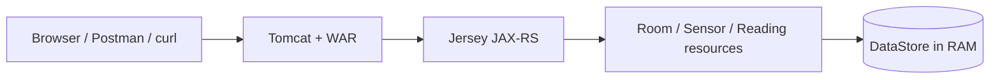
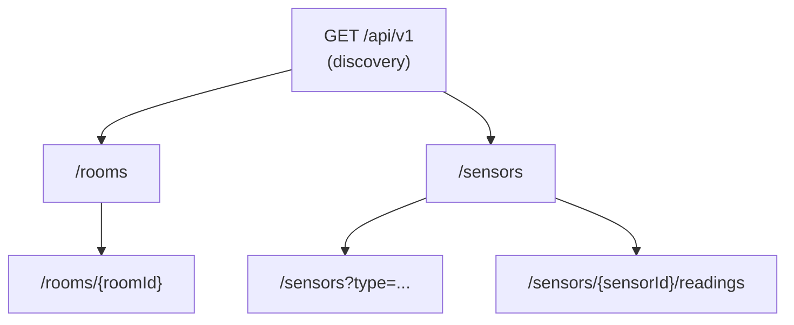
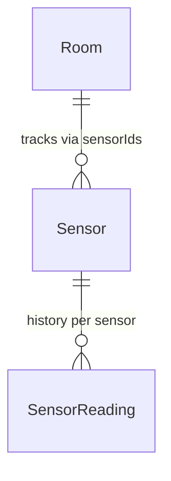

# Smart Campus — Sensor & Room Management API

**Module:** 5COSC022W Client-Server Architectures (2025/26)  
**Student:** Thevindu Wickramaarachchi — w2151910  
**GitHub:** [Repository Link](https://github.com/thev1ndu/w2151910_csa_cw)

A RESTful API for the university "Smart Campus" initiative, built with **JAX-RS (Jersey)** and deployed as a **WAR** on Apache Tomcat. The service manages **rooms**, **sensors** deployed within them, and a **historical log of sensor readings**. All data is stored **in memory** using `HashMap` and `ArrayList` — no database technology is used.

---

## How to build and run

**Prerequisites:** JDK 8+, Maven 3.x, Apache Tomcat (or any servlet container).

1. Build the WAR:

   ```bash
   mvn clean package
   ```

2. Copy `target/smart-campus-api-1.0-SNAPSHOT.war` into Tomcat's `webapps/` folder.

3. Start Tomcat. The API is available at:

   ```
   http://localhost:8080/api/v1
   ```

The entry point is registered via `@ApplicationPath("/api/v1")` on the `SmartCampusApplication` class, which extends `javax.ws.rs.core.Application`.

---

## API design overview

The API mirrors the physical campus structure: **rooms** are the top-level resource, **sensors** are deployed inside rooms, and each sensor accumulates **readings** over time. A discovery endpoint at the API root provides metadata and navigational links so clients always know where to start.



### Resource hierarchy



### Domain model relationships



### Endpoint summary

| Method      | Path                                  | Description                                              |
| ----------- | ------------------------------------- | -------------------------------------------------------- |
| GET         | `/api/v1`                             | Discovery — metadata, version, HATEOAS links             |
| GET, POST   | `/api/v1/rooms`                       | List all rooms / create a new room                       |
| GET, DELETE | `/api/v1/rooms/{roomId}`              | Get room detail / delete (blocked if sensors are linked) |
| GET, POST   | `/api/v1/sensors`                     | List sensors (optional `?type=` filter) / register       |
| GET, POST   | `/api/v1/sensors/{sensorId}/readings` | Reading history / append a new reading                   |

**Models:** `Room`, `Sensor`, `SensorReading`, `ErrorMessage`.

---

## Sample `curl` commands

```bash
# Discovery
curl -i "http://localhost:8080/api/v1"

# List all rooms
curl -i "http://localhost:8080/api/v1/rooms"

# Create a room
curl -i -X POST -H "Content-Type: application/json" \
  -d '{"id":"LIB-301","name":"Library Quiet Study","capacity":40}' \
  "http://localhost:8080/api/v1/rooms"

# Get a single room
curl -i "http://localhost:8080/api/v1/rooms/LIB-301"

# Delete a room
curl -i -X DELETE "http://localhost:8080/api/v1/rooms/LIB-301"

# List sensors (with optional type filter)
curl -i "http://localhost:8080/api/v1/sensors"
curl -i "http://localhost:8080/api/v1/sensors?type=Temperature"

# Register a sensor
curl -i -X POST -H "Content-Type: application/json" \
  -d '{"id":"TEMP-001","type":"Temperature","status":"ACTIVE","currentValue":21.5,"roomId":"LIB-301"}' \
  "http://localhost:8080/api/v1/sensors"

# Post a reading
curl -i -X POST -H "Content-Type: application/json" \
  -d '{"timestamp":1713868800000,"value":22.3}' \
  "http://localhost:8080/api/v1/sensors/TEMP-001/readings"

# Get readings history
curl -i "http://localhost:8080/api/v1/sensors/TEMP-001/readings"
```

---

## Video demo scenario

This section is the script for the video demonstration. Follow each step in order — read the description, run the `curl` command, and verify the expected result.

### Step 1: API Discovery

Check the API is running. The discovery endpoint returns metadata (name, version, contact) and HATEOAS links to the main collections. The links are **built dynamically** using `UriInfo` so they adapt to any deployment.

**Expected:** `200 OK` with JSON containing `name`, `version`, `contact`, and `links`.

```bash
curl -i "http://localhost:8080/api/v1"
```

### Step 2: List Existing Rooms

Fetch all rooms. The API comes pre-loaded with seed data (`R101`, `R102`).

**Expected:** `200 OK` with a JSON array of room objects.

```bash
curl -i "http://localhost:8080/api/v1/rooms"
```

### Step 3: Create a New Room

Create room `LIB-301`. POST returns `201 Created` with a `Location` header built via `UriInfo`.

**Expected:** `201 Created`, `Location: .../api/v1/rooms/LIB-301`, body contains the new room JSON.

```bash
curl -i -X POST \
  -H "Content-Type: application/json" \
  -d '{"id":"LIB-301","name":"Library Quiet Study","capacity":40}' \
  "http://localhost:8080/api/v1/rooms"
```

### Step 4: Verify the New Room

Fetch `LIB-301` by ID to confirm it was persisted in the in-memory `DataStore`.

**Expected:** `200 OK` with the `LIB-301` room JSON.

```bash
curl -i "http://localhost:8080/api/v1/rooms/LIB-301"
```

### Step 5: Error — Sensor in a Non-Existent Room (422)

Try to register a sensor into room `NO-SUCH-ROOM`. This triggers `LinkedResourceNotFoundException` → mapped to **422** via `LinkedResourceNotFoundExceptionMapper`. The response uses the `ErrorMessage` POJO.

**Expected:** `422 Unprocessable Entity` with structured JSON error.

```bash
curl -i -X POST \
  -H "Content-Type: application/json" \
  -d '{"id":"X-1","type":"CO2","status":"ACTIVE","currentValue":0,"roomId":"NO-SUCH-ROOM"}' \
  "http://localhost:8080/api/v1/sensors"
```

### Step 6: Register a Sensor Successfully

Register temperature sensor `TEMP-001` into `LIB-301`. The room must exist or a 422 is returned (as shown above).

**Expected:** `201 Created`, `Location` header, sensor JSON in body, `LIB-301.sensorIds` now includes `TEMP-001`.

```bash
curl -i -X POST \
  -H "Content-Type: application/json" \
  -d '{"id":"TEMP-001","type":"Temperature","status":"ACTIVE","currentValue":21.5,"roomId":"LIB-301"}' \
  "http://localhost:8080/api/v1/sensors"
```

### Step 7: Filter Sensors by Type

Use `@QueryParam("type")` to filter. Only sensors with type `Temperature` are returned.

**Expected:** `200 OK` with a filtered JSON array.

```bash
curl -i "http://localhost:8080/api/v1/sensors?type=Temperature"
```

### Step 8: Add a Sensor Reading

POST a reading to the sub-resource `/sensors/TEMP-001/readings`. The server auto-generates `id` if missing and updates `Sensor.currentValue` to `22.3`. This uses the **sub-resource locator** pattern — `SensorResource` delegates to `SensorReadingResource`.

**Expected:** `201 Created` with reading JSON.

```bash
curl -i -X POST \
  -H "Content-Type: application/json" \
  -d '{"timestamp":1713868800000,"value":22.3}' \
  "http://localhost:8080/api/v1/sensors/TEMP-001/readings"
```

### Step 9: Get Sensor Readings History

Retrieve all readings for `TEMP-001`. This returns the full history list.

**Expected:** `200 OK` with JSON array of readings.

```bash
curl -i "http://localhost:8080/api/v1/sensors/TEMP-001/readings"
```

### Step 10: Error — Deleting a Room in Use (409)

Try to delete `LIB-301` while `TEMP-001` is still assigned. This triggers `RoomNotEmptyException` → mapped to **409 Conflict** via `RoomNotEmptyExceptionMapper`. Data integrity is enforced.

**Expected:** `409 Conflict` with `ErrorMessage` JSON.

```bash
curl -i -X DELETE "http://localhost:8080/api/v1/rooms/LIB-301"
```

### Step 11: Error — Unsupported Media Type (415)

Send `Content-Type: text/plain` instead of `application/json`. Jersey's `@Consumes(APPLICATION_JSON)` rejects the request before the method body runs.

**Expected:** `415 Unsupported Media Type`.

```bash
curl -i -X POST \
  -H "Content-Type: text/plain" \
  -d 'This is not valid JSON' \
  "http://localhost:8080/api/v1/sensors"
```

### Step 12: DELETE Idempotency Demo

First, remove the sensor so `LIB-301` is empty, then delete the room twice. First DELETE returns `204 No Content`. Second DELETE returns `404 Not Found` — the server state (room absent) is identical after both calls, proving the operation is **idempotent in terms of state**.

```bash
# Remove the sensor from the room first (or use a room with no sensors)
# First delete — room exists and is empty
curl -i -X DELETE "http://localhost:8080/api/v1/rooms/LIB-301"

# Second delete — room already gone, same server state
curl -i -X DELETE "http://localhost:8080/api/v1/rooms/LIB-301"
```

**Expected:** First call → `204`, second call → `404` with `ErrorMessage` JSON. Server state is the same after both.

---

**Tools used:** Postman and/or `curl` in the terminal.

The full video was recorded separately and submitted via **Blackboard** as required by the module brief.

---

## Written report (answers to the brief)

### Part 1: Service Architecture & Setup

#### 1.1 — Project configuration and JAX-RS resource lifecycle

The project is a standard Maven WAR that pulls in **Jersey** (`jersey-container-servlet`, `jersey-media-json-jackson` for JSON serialisation, and HK2 for dependency injection). The application entry point is `SmartCampusApplication`, annotated with `@ApplicationPath("/api/v1")`, which establishes the versioned API root. Jersey scans the configured packages and registers all `@Path`-annotated resource classes and `@Provider`-annotated filters and mappers automatically.

**Resource lifecycle — request-scoped by default:** In JAX-RS, resource classes such as `RoomResource` and `SensorResource` are **instantiated per request**. Each incoming HTTP request receives a fresh instance of the resource class, and that instance is discarded after the response is sent. The runtime does **not** treat them as singletons by default. This means any state held in instance fields (e.g. `private int counter`) would be reset on every call and could not be shared between requests.

**Impact on in-memory data management:** Because a new resource instance is created per request, I cannot store shared data (rooms, sensors, readings) in instance variables — they would simply disappear after each response. Instead, I centralised all shared state in a **`DataStore` singleton** (a private constructor with a static `getInstance()` method). Every resource instance fetches the same singleton `DataStore`, ensuring all requests see the same maps and lists. To prevent **race conditions** where two concurrent requests try to modify the same `HashMap` simultaneously, all public methods on `DataStore` are marked **`synchronized`**. This ensures that only one thread can execute any `DataStore` method at a time on the singleton instance, preventing data corruption without requiring any additional imports — `synchronized` is a built-in Java keyword. The trade-off is slightly reduced throughput under heavy concurrency, but for a coursework-scale API this is perfectly acceptable. In a production system, one would use `ConcurrentHashMap` or a proper database with ACID transactions.

#### 1.2 — Discovery endpoint and HATEOAS

`GET /api/v1` returns a JSON object containing API **name**, **version**, **description**, **contact** details, and a **links** map. The link URLs are **built dynamically** at runtime using `@Context UriInfo` — specifically `uriInfo.getBaseUri()` — so they automatically reflect whatever host and context path the WAR is deployed under. This means the API is portable: if the WAR is deployed on a different server or context root, the links still resolve correctly without code changes.

**Why HATEOAS matters:** Hypermedia as the Engine of Application State (HATEOAS) is considered a hallmark of mature RESTful design because it allows the API to **guide clients** through available actions via links embedded in responses, rather than forcing them to construct URLs from static documentation. This decouples clients from the server's URL structure. If the server restructures its paths (e.g. moving from `/api/v1/rooms` to `/api/v2/spaces`), clients that follow links dynamically adapt automatically, whereas clients that hardcode URLs would break. HATEOAS also makes the API **self-documenting** — a developer can discover all available resources simply by navigating from the root endpoint, without needing to consult external documentation. Compared to static PDF or Swagger docs (which can become outdated), embedded links are always in sync with the running server.

---

### Part 2: Room Management

#### 2.1 — Room resource implementation

`RoomResource` handles the `/rooms` path with three operations:

- **`GET /rooms`** returns a full list of all rooms as a JSON array.
- **`POST /rooms`** creates a new room. On success the response is `HTTP 201 Created`, with the created room in the body and a `Location` header (e.g. `.../api/v1/rooms/LIB-301`) built via `UriInfo.getAbsolutePathBuilder()`. This follows REST convention: the client can immediately follow the `Location` to fetch or verify the new resource.
- **`GET /rooms/{roomId}`** returns a single room by ID, or `404 Not Found` with an `ErrorMessage` JSON body if the ID does not exist.

**Full objects vs IDs only in list responses:** When `GET /rooms` returns the list, I chose to return **full room objects** (id, name, capacity, sensorIds) rather than just an array of IDs. Returning only IDs would minimise the response payload, reducing **network bandwidth** usage, which is beneficial if there are thousands of rooms or if each object carries large metadata. However, it forces the client to make **N additional `GET /rooms/{id}` requests** to display any meaningful information (name, capacity), leading to the "N+1 problem" — potentially more total bandwidth and latency than a single larger response. Returning full objects trades a slightly larger initial payload for **fewer round-trips** and simpler client-side processing, since the client has everything it needs in one call. For this campus-scale API, full objects are the pragmatic choice.

#### 2.2 — Room deletion and idempotency

**Data integrity constraint:** `DELETE /rooms/{roomId}` checks whether the room's `sensorIds` list is empty before proceeding. If sensors are still assigned, the resource throws `RoomNotEmptyException`, which is caught by `RoomNotEmptyExceptionMapper` and returned as `HTTP 409 Conflict` with a structured `ErrorMessage` JSON body explaining that the room still has active hardware assigned. This prevents **data orphans** — sensors that reference a room that no longer exists.

**Idempotency analysis:** The first DELETE on a room with no sensors succeeds and returns `204 No Content`. If a client mistakenly sends the **exact same DELETE request again**, the room is already gone from the `DataStore`, so the resource returns `404 Not Found` with an `ErrorMessage` body. Although the HTTP **status code** changes between calls (204 → 404), the **server-side state** is identical after both: the room does not exist. This is the defining property of idempotency — repeated identical requests produce the same server state. The operation does not "undo" the deletion, create side effects, or toggle any state. It is therefore **idempotent in terms of resource state**, consistent with the HTTP specification's definition that "the side-effects of N > 0 identical requests is the same as for a single request" (RFC 7231 §4.2.2).

---

### Part 3: Sensor Operations & Linking

#### 3.1 — Sensor registration and `@Consumes` enforcement

`SensorResource` at `/sensors` supports:

- **`POST /sensors`** to register a new sensor. Before persisting, the logic verifies that the `roomId` specified in the JSON body actually exists in `DataStore`. If it does not, a `LinkedResourceNotFoundException` is thrown → mapped to `422 Unprocessable Entity` (see Part 5 for why 422 is chosen over 404).
- On success, the sensor is saved, the room's `sensorIds` list is updated, and the response is `201 Created` with a `Location` header.

**Technical consequences of `@Consumes(MediaType.APPLICATION_JSON)`:** This annotation tells the JAX-RS runtime that the POST method only accepts `application/json` request bodies. If a client sends a request with a different `Content-Type` header — for example `text/plain` or `application/xml` — the runtime attempts to find a registered `MessageBodyReader` capable of deserialising that media type into the method's parameter type (`Sensor`). Since no such reader is registered (only the Jackson JSON provider is present), the runtime **rejects the request before the method body ever executes**, returning `HTTP 415 Unsupported Media Type`. This is handled entirely by the JAX-RS framework, not by application code. The `@Consumes` annotation thus acts as an automatic **content negotiation guard**, ensuring only well-formed JSON reaches the business logic and protecting against malformed or unexpected input formats.

#### 3.2 — Filtered retrieval with `@QueryParam`

`GET /sensors` accepts an optional `@QueryParam("type")` parameter. When provided (e.g. `GET /sensors?type=Temperature`), the response filters the collection to only include sensors whose type matches (case-insensitive). When omitted, all sensors are returned.

**`@QueryParam` vs path-based filtering:** An alternative design would encode the filter in the URL path, e.g. `/sensors/type/CO2`. However, query parameters are generally considered superior for filtering and searching because:

1. **The resource identity is preserved.** The collection is still `/sensors` regardless of filtering — query parameters are modifiers, not part of the resource identifier. Path-based filtering implies `/sensors/type/CO2` is a distinct resource, which is semantically misleading.
2. **Composability.** Multiple query parameters can be combined freely (e.g. `?type=CO2&status=ACTIVE`) without needing to define additional `@Path` templates for every combination. Path-based alternatives would require templates like `/sensors/type/{t}/status/{s}`, which scale poorly.
3. **HTTP caching semantics.** Caches treat the path as the primary resource key and query strings as variations, which aligns with how filtering should work — it is the same resource with different views.
4. **Convention.** Query parameters for filtering are an established REST convention (used by GitHub, Stripe, AWS, etc.), so client developers expect this pattern.

---

### Part 4: Deep Nesting with Sub-Resources

#### 4.1 — Sub-resource locator pattern

In `SensorResource`, the method annotated with `@Path("/{sensorId}/readings")` does **not** have an HTTP method annotation (`@GET`, `@POST`). Instead, it acts as a **sub-resource locator** — it creates and returns a new instance of `SensorReadingResource`, passing the `sensorId` as a constructor argument. Jersey then dispatches the HTTP method (GET or POST) to the appropriate method within `SensorReadingResource`.

**Architectural benefits of delegation:**

1. **Separation of concerns.** Sensor CRUD operations and reading history management are logically distinct responsibilities. Placing them in separate classes (`SensorResource` and `SensorReadingResource`) keeps each class focused and cohesive.
2. **Scalability of the codebase.** If future requirements add more nested paths under a sensor (e.g. `.../alerts`, `.../calibration-logs`), each can be handled by its own dedicated sub-resource class. Without this pattern, a single `SensorResource` class would accumulate every nested method, becoming an unwieldy "god class" that is hard to read, test, and maintain.
3. **Independent testability.** `SensorReadingResource` can be unit-tested in isolation by constructing it directly with a known `sensorId`, without needing to route through the parent resource.
4. **Reusability.** The same sub-resource class could potentially be reused under different parent resources if the API evolves.

#### 4.2 — Historical data management and `currentValue` updates

`SensorReadingResource` implements:

- **`GET /`** returns the full list of `SensorReading` objects for the given sensor from `DataStore`. If the sensor ID does not exist, it returns `404 Not Found`.
- **`POST /`** appends a new reading to the sensor's history. The server auto-generates a UUID for the reading's `id` if the client does not provide one, and sets the `timestamp` to `System.currentTimeMillis()` if it is missing or zero.

**Side effect — `currentValue` update:** After a successful POST, the parent `Sensor` object's `currentValue` field is updated to match the new reading's `value`. This ensures data consistency across the API — a subsequent `GET /sensors/TEMP-001` will reflect the latest measurement without requiring a separate update call.

**State constraint:** If the sensor's `status` is `"MAINTENANCE"`, it is considered physically disconnected and cannot accept new readings. In this case, `POST` throws `SensorUnavailableException`, mapped to `HTTP 403 Forbidden`.

---

### Part 5: Advanced Error Handling, Exception Mapping & Logging

All error responses use a consistent `ErrorMessage` POJO with three fields: `error` (short label), `status` (HTTP code), and `message` (human-readable explanation). This ensures the API is **"leak-proof"** — it never returns a raw Java stack trace or default server error page.

#### 5.1 — Resource Conflict (409)

**Scenario:** Attempting to delete a room that still has sensors assigned.  
**Implementation:** `RoomResource.deleteRoom()` checks `room.getSensorIds().isEmpty()`. If not empty, it throws `RoomNotEmptyException`. The `RoomNotEmptyExceptionMapper` catches this and returns `HTTP 409 Conflict` with an `ErrorMessage` JSON body explaining that the room is currently occupied by active hardware and the sensors must be removed first.

#### 5.2 — Dependency Validation (422)

**Scenario:** A client POSTs a new sensor with a `roomId` that does not exist in the system.  
**Implementation:** `SensorResource.createSensor()` looks up the `roomId` in `DataStore`. If `null`, it throws `LinkedResourceNotFoundException`. The `LinkedResourceNotFoundExceptionMapper` returns `HTTP 422 Unprocessable Entity`.

**Why 422 instead of 404:** The client's request was sent to `/sensors`, which **does exist** as a valid endpoint. The JSON payload is syntactically correct and successfully parsed. The problem is purely **semantic** — a reference inside the payload points to a room that is not in the system. Returning `404 Not Found` would mislead the client into thinking the `/sensors` endpoint itself does not exist, which is incorrect. `422 Unprocessable Entity` communicates precisely that "your request was well-formed, but the entity it contains cannot be processed due to semantic errors" — in this case, a broken foreign-key reference. This distinction is defined in RFC 4918 and is widely adopted by APIs that need to differentiate between "URL not found" and "payload validation failed".

#### 5.3 — State Constraint (403)

**Scenario:** A POST to add a reading is attempted on a sensor with status `"MAINTENANCE"`.  
**Implementation:** `SensorReadingResource.addReading()` checks `sensor.getStatus()`. If it equals `"MAINTENANCE"`, a `SensorUnavailableException` is thrown. The `SensorUnavailableExceptionMapper` returns `HTTP 403 Forbidden` with an `ErrorMessage` explaining that the sensor is in maintenance mode and cannot accept readings.

| Exception                         | HTTP | Scenario                               |
| --------------------------------- | ---- | -------------------------------------- |
| `RoomNotEmptyException`           | 409  | Room still has sensors; delete blocked |
| `LinkedResourceNotFoundException` | 422  | `roomId` in JSON body doesn't exist    |
| `SensorUnavailableException`      | 403  | Sensor in `MAINTENANCE` mode           |

#### 5.4 — Global Safety Net (500)

`GenericExceptionMapper` implements `ExceptionMapper<Throwable>` and intercepts **any** unhandled runtime exception (e.g. `NullPointerException`, `IndexOutOfBoundsException`). It logs the full stack trace internally using `Logger.log(Level.SEVERE, ...)` for debugging, but returns only a **generic** `ErrorMessage` to the client: `"An unexpected error occurred."` with status `500`.

**Cybersecurity risks of exposing stack traces:** If internal Java stack traces were returned to external API consumers, an attacker could extract:

- **Package and class names** (e.g. `com.smartcampus.store.DataStore`) — revealing the application's internal architecture and potential attack surfaces.
- **Framework names and versions** (e.g. `jersey-container-servlet-2.39`) — enabling the attacker to search for known CVEs (Common Vulnerabilities and Exposures) targeting those specific versions.
- **File paths** (e.g. `/Users/admin/tomcat/webapps/...`) — exposing the server's directory structure, operating system, and deployment configuration.
- **Line numbers and method signatures** — providing a precise map of the codebase that could help craft more targeted injection attacks or identify logic flaws.
- **Database connection strings or internal hostnames** if exceptions originate from persistence layers.

This information constitutes **information disclosure**, classified under OWASP Top 10 (A01:2021 – Broken Access Control). Keeping error responses generic is basic **security hygiene** for any API exposed to external consumers.

#### 5.5 — API Request & Response Logging Filter

`LoggingFilter` implements both `ContainerRequestFilter` and `ContainerResponseFilter`, registered via the `@Provider` annotation. On every incoming request it logs the **HTTP method**, **full URI**, **Content-Type**, and **Accept** headers. On every outgoing response it logs the **method**, **URI**, **status code with reason phrase** (e.g. `201 Created`), and the **elapsed processing time** in milliseconds (calculated by storing `System.currentTimeMillis()` as a request property on the way in, and computing the difference on the way out).

**Why a filter instead of manual `Logger.info()` in every method:** JAX-RS filters implement the **cross-cutting concern** pattern. Logging is a concern that applies uniformly to every endpoint, and it should not be mixed with business logic. If `LOG.info()` were manually inserted into every resource method:

1. **Duplication.** Every method would need identical boilerplate code, violating the DRY (Don't Repeat Yourself) principle.
2. **Inconsistency risk.** Developers might forget to add logging to new methods, or use different formats in different places, making log analysis difficult.
3. **Maintenance cost.** If the logging format needs to change (e.g. adding a correlation ID or request duration), every single method would need to be edited. With a filter, you change one class and all endpoints are updated.
4. **Separation of concerns.** The resource method should focus solely on business logic (validating input, querying data, returning responses). Mixing logging with business logic makes methods harder to read and test.

Filters ensure **centralised, consistent, and maintainable** observability across the entire API.

---

## Video demonstration

The full video walkthrough was recorded separately and submitted via **Blackboard**. The video covers all 12 steps described in the demo scenario above, demonstrating every endpoint, error case (422, 409, 415, 403), the sub-resource locator pattern, and DELETE idempotency.

---

## References

- Course module: **5COSC022W** — University of Westminster
- JAX-RS implementation: **Jersey 2.x** (javax namespace)
- No Spring Boot or database technology was used, as required by the coursework brief
