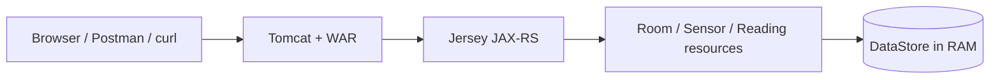
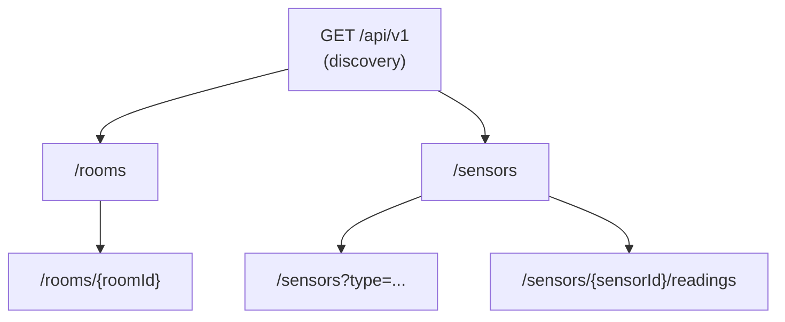
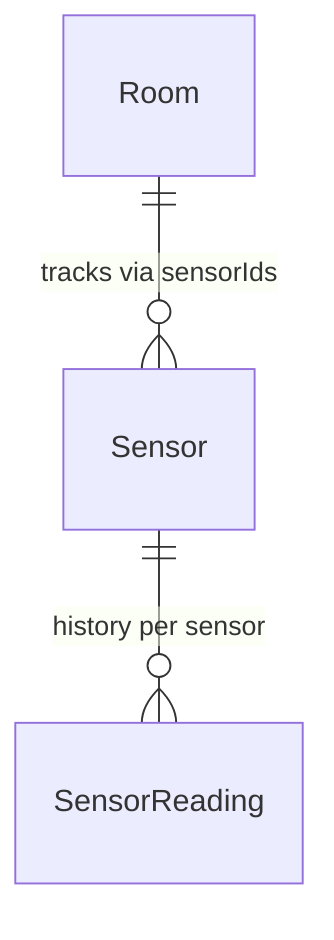

# Smart Campus — Sensor & Room Management API

**Module:** 5COSC022W Client-Server Architectures (2025/26)  
**Student:** Thevindu Wickramaarachchi — w2151910  
**GitHub:** [Repository Link](https://github.com/thev1ndu/w2151910_csa_cw)

A RESTful API for the university "Smart Campus" initiative, built with **JAX-RS (Jersey)** and deployed as a **WAR** on Apache Tomcat. The service manages **rooms**, **sensors** deployed within them, and a **historical log of sensor readings**. All data is stored **in memory** no database technology is used.

---

## How to build and run

**Prerequisites:** JDK 8+, Maven 3.x, Apache Tomcat (or any servlet container).

1. Build the WAR:

   ```bash
   mvn clean package
   ```

2. Copy `target/smart-campus-api-1.0-SNAPSHOT.war` into Tomcat's `webapps/` folder.

3. Start Tomcat. The API is available at:

   ```
   http://localhost:8080/api/v1
   ```

The entry point is registered via `@ApplicationPath("/api/v1")` on the `SmartCampusApplication` class, which extends `javax.ws.rs.core.Application`.

---

## API design overview

The API mirrors the physical campus structure: **rooms** are the top-level resource, **sensors** are deployed inside rooms, and each sensor accumulates **readings** over time. A discovery endpoint at the API root provides metadata and navigational links so clients always know where to start.



### Resource hierarchy



### Domain model relationships



### Endpoint summary

| Method      | Path                                  | Description                                              |
| ----------- | ------------------------------------- | -------------------------------------------------------- |
| GET         | `/api/v1`                             | Discovery — metadata, version, HATEOAS links             |
| GET, POST   | `/api/v1/rooms`                       | List all rooms / create a new room                       |
| GET, DELETE | `/api/v1/rooms/{roomId}`              | Get room detail / delete (blocked if sensors are linked) |
| GET, POST   | `/api/v1/sensors`                     | List sensors (optional `?type=` filter) / register       |
| GET, POST   | `/api/v1/sensors/{sensorId}/readings` | Reading history / append a new reading                   |

**Models:** `Room`, `Sensor`, `SensorReading`, `ErrorMessage`.

---

## Sample `curl` commands

```bash
# Discovery
curl -i "http://localhost:8080/api/v1"

# List all rooms
curl -i "http://localhost:8080/api/v1/rooms"

# Create a room
curl -i -X POST -H "Content-Type: application/json" \
  -d '{"id":"LIB-301","name":"Library Quiet Study","capacity":40}' \
  "http://localhost:8080/api/v1/rooms"

# Get a single room
curl -i "http://localhost:8080/api/v1/rooms/LIB-301"

# Delete a room
curl -i -X DELETE "http://localhost:8080/api/v1/rooms/LIB-301"

# List sensors (with optional type filter)
curl -i "http://localhost:8080/api/v1/sensors"
curl -i "http://localhost:8080/api/v1/sensors?type=Temperature"

# Register a sensor
curl -i -X POST -H "Content-Type: application/json" \
  -d '{"id":"TEMP-001","type":"Temperature","status":"ACTIVE","currentValue":21.5,"roomId":"LIB-301"}' \
  "http://localhost:8080/api/v1/sensors"

# Post a reading
curl -i -X POST -H "Content-Type: application/json" \
  -d '{"timestamp":1713868800000,"value":22.3}' \
  "http://localhost:8080/api/v1/sensors/TEMP-001/readings"

# Get readings history
curl -i "http://localhost:8080/api/v1/sensors/TEMP-001/readings"
```

---

## Written Report (Answers to the Brief)

### Part 1: Service Architecture & Setup

**Q: Explain the default lifecycle of a JAX-RS Resource class. Is a new instance instantiated for every incoming request, or does the runtime treat it as a singleton? How does this impact data management and synchronisation?**

By default, JAX-RS follows a per-request lifecycle, meaning the runtime creates a fresh instance of each resource class (such as `RoomResource` or `SensorResource`) for every incoming HTTP request, and discards it once the response is sent. This design prevents one request from accidentally corrupting state for another, but it also means that any data stored in instance fields is lost between requests.

To persist data across requests, the application uses a singleton `DataStore` class with a private constructor and a static `getInstance()` method, ensuring that only one shared instance exists. All resource classes obtain a reference to this same object. Because Apache Tomcat serves requests concurrently across multiple threads, the `DataStore` must be thread-safe. It achieves this by using `ConcurrentHashMap` for rooms, sensors, and reading collections, which permits concurrent reads without locking and uses fine-grained segment-level locks for writes. Sensor reading lists use `CopyOnWriteArrayList`, which is well suited for read-heavy, write-light workloads. The `computeIfAbsent` method is used when creating new reading lists to avoid race conditions where two threads might simultaneously attempt to initialise the same entry. These `java.util.concurrent` structures eliminate the need for `synchronized` blocks entirely, resulting in better throughput under load.

**Q: Why is HATEOAS considered a hallmark of advanced RESTful design? How does it benefit client developers?**

HATEOAS (Hypermedia as the Engine of Application State) is the principle that API responses should include navigational links so that clients can discover available actions at runtime rather than relying on hardcoded URLs. The `DiscoveryResource` at `GET /api/v1` demonstrates this by building links to `/rooms` and `/sensors` dynamically using `@Context UriInfo`, which means the URLs automatically adapt to whatever host and port the server is deployed on.

This approach benefits client developers in two key ways. First, it decouples the client from the server's URL structure — if endpoints are renamed or versioned, clients that follow links will continue to work without modification. Second, it makes the API self-documenting; a developer can start at the root endpoint and discover every available resource by following links, reducing the dependency on external documentation.

---

### Part 2: Room Management

**Q: When returning a list of rooms, what are the implications of returning only IDs versus full objects?**

The `GET /rooms` endpoint returns complete `Room` objects (including `id`, `name`, `capacity`, and `sensorIds`) rather than just a list of identifiers. If only IDs were returned, the client would need to issue a separate `GET /rooms/{roomId}` request for each room to obtain its details. This is known as the N+1 problem, and for a campus with potentially hundreds of rooms it would result in excessive network round-trips and increased server load. Returning full objects allows the client to obtain all necessary information in a single request, which is significantly more efficient. The trade-off is a slightly larger response payload, but for structured data of this scale the bandwidth overhead is negligible compared to the latency savings.

**Q: Is the DELETE operation idempotent in your implementation? Justify your answer.**

Yes, the `DELETE /rooms/{roomId}` operation is idempotent. The first successful call removes the room from the `DataStore` and returns `204 No Content`. If the same request is repeated, the room no longer exists, so the method returns `404 Not Found`. Although the response status code differs between the two calls, the server-side state is identical after both — the room is absent. According to RFC 7231, idempotency requires that "the side-effects of N > 0 identical requests is the same as for a single request," which is exactly what this implementation guarantees. Additionally, if the room still has sensors assigned, the `RoomNotEmptyException` is thrown, returning `409 Conflict` and preventing data orphans.

---

### Part 3: Sensor Operations & Linking

**Q: What are the technical consequences if a client sends a non-JSON content type to a method annotated with `@Consumes(APPLICATION_JSON)`?**

The `@Consumes(MediaType.APPLICATION_JSON)` annotation on the `POST /sensors` method instructs the JAX-RS runtime to only accept request bodies with a `Content-Type` of `application/json`. If a client submits a different format such as `text/plain` or `application/xml`, Jersey automatically rejects the request with an HTTP `415 Unsupported Media Type` response before the method body is ever executed. This serves as an effective gatekeeper that ensures only correctly formatted JSON payloads reach the business logic, preventing parsing errors and potential security issues from unexpected input formats.

**Q: Contrast `@QueryParam` filtering with a path-based approach. Why is the query parameter approach superior for filtering collections?**

The `GET /sensors` endpoint supports an optional `@QueryParam("type")` filter. If provided (e.g., `?type=Temperature`), only matching sensors are returned; otherwise, the full collection is returned. This approach is preferable to a path-based alternative such as `/sensors/type/CO2` for several reasons. First, the URI `/sensors` consistently identifies the sensor collection as a single resource, and the query parameter merely adjusts the view — this aligns with REST conventions where the path identifies the resource and query parameters refine the representation. Second, query parameters are composable, meaning additional filters (e.g., `?type=CO2&status=ACTIVE`) can be added without requiring new `@Path` annotations. Third, the approach follows established industry patterns used by major APIs such as GitHub and Stripe, making it immediately familiar to developers.

---

### Part 4: Deep Nesting with Sub-Resources

**Q: Discuss the architectural benefits of the Sub-Resource Locator pattern.**

In `SensorResource`, the method annotated with `@Path("/{sensorId}/readings")` does not carry any HTTP method annotation. Instead, it acts as a sub-resource locator that instantiates and returns a `SensorReadingResource` object, passing the `sensorId` as context. Jersey then dispatches the actual HTTP method (`GET` or `POST`) to the appropriate method within that sub-resource class.

This pattern offers several architectural advantages over defining all nested paths in a single controller. First, it enforces separation of concerns — sensor CRUD operations and reading history management are logically distinct responsibilities and belong in separate classes. Second, it improves extensibility; if future requirements call for additional nested resources (such as `/sensors/{id}/alerts`), each can be implemented as an independent class without increasing the complexity of `SensorResource`. Third, the sub-resource class can be unit-tested in isolation by simply constructing it with a sensor ID, without needing to invoke the parent resource. This modular design keeps individual classes focused and manageable as the API grows.

---

### Part 5: Error Handling, Exception Mapping & Logging

**Q: Why is HTTP 422 more semantically accurate than 404 when a referenced resource inside the JSON payload does not exist?**

When a client sends a `POST /sensors` request with a `roomId` that does not correspond to any existing room, the `SensorResource` throws a `LinkedResourceNotFoundException`, which is mapped to `422 Unprocessable Entity`. Using `404 Not Found` in this scenario would be misleading because the target endpoint `/sensors` does exist and is functioning correctly. The issue is not with the URL but with the semantic validity of the request body — the JSON is syntactically well-formed, but it references a room that the server cannot locate. HTTP 422 communicates precisely this situation: "the request was well-formed but could not be processed due to semantic errors," which gives the client a clear and accurate understanding of what went wrong.

**Q: From a cybersecurity standpoint, what are the risks of exposing Java stack traces to external consumers?**

The `GenericExceptionMapper` implements `ExceptionMapper<Throwable>` to catch any unhandled runtime exception and return a generic `500 Internal Server Error` with the message "An unexpected error occurred." The full exception details are logged server-side using `Logger.log(Level.SEVERE, ...)` but are never included in the client response.

Exposing raw stack traces to external consumers constitutes an information disclosure vulnerability. A stack trace reveals internal package and class names, which exposes the application's architecture. It may also contain framework version numbers, enabling attackers to search for known CVEs targeting those specific versions. File paths within the trace can disclose the server's directory structure and operating system. Method names and line numbers provide a detailed map of the codebase, which can be used to identify potential injection points or logic flaws. This category of vulnerability is recognised by OWASP as part of their Top 10 security risks. Returning only a generic error message to clients is therefore an essential security practice.

**Q: Why is it advantageous to use JAX-RS filters for logging rather than inserting logging statements in every resource method?**

The `LoggingFilter` class implements both `ContainerRequestFilter` and `ContainerResponseFilter` and is registered as a `@Provider`. It intercepts every incoming request to log the HTTP method and URI, and every outgoing response to log the status code.

Using a filter for this cross-cutting concern is advantageous because it eliminates code duplication — the logging logic is written once rather than repeated in every resource method. It also guarantees consistency, as every endpoint is logged in the same format regardless of which resource handles the request. If the log format needs to be changed, only the filter class requires modification. Finally, it keeps the resource classes focused on their primary responsibility of handling business logic, adhering to the single-responsibility principle.

---

## Video demonstration

The full video walkthrough was recorded separately and submitted via **Blackboard**. The video covers all 16 steps described in the demo scenario, demonstrating every endpoint, error case (422, 403, 409, 415, 500), the sub-resource locator pattern, sensor deletion, room deletion, and DELETE idempotency.

---

## References

- Course module: **5COSC022W** — University of Westminster
- JAX-RS implementation: **Jersey 2.x** (javax namespace)
- No Spring Boot or database technology was used, as required by the coursework brief
